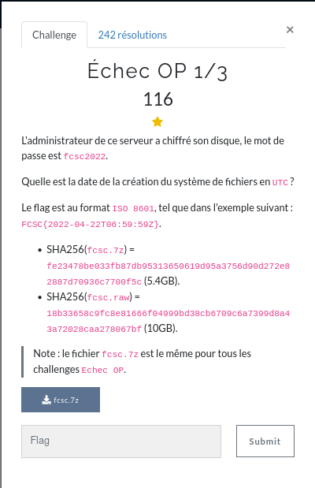

# Echec OP 1/3



## First look

How to **check file type** ?
```
$ file fcsc.raw
fcsc.raw: DOS/MBR boot sector, extended partition table (last)
```
Partitions tables holds partitions.<br>
How to **display partition table** ?
```
$ fdisk -l fcsc.raw
Disque fcsc.raw : 10 GiB, 10737418240 octets, 20971520 secteurs
Unités : secteur de 1 × 512 = 512 octets
Taille de secteur (logique / physique) : 512 octets / 512 octets
taille d'E/S (minimale / optimale) : 512 octets / 512 octets
Type d'étiquette de disque : gpt
Identifiant de disque : 60DA4A85-6F6F-4043-8A38-0AB83853E6DC

Périphérique   Début      Fin Secteurs Taille Type
fcsc.raw1       2048     4095     2048     1M Amorçage BIOS
fcsc.raw2       4096  1861631  1857536   907M Système de fichiers Linux
fcsc.raw3    1861632 20969471 19107840   9,1G Système de fichiers Linux
```

Let's mount it ! (offset = starting sector * block size)
```
$ mkdir -p mountpoint
$ sudo mount -o offset=953155584 fcsc.raw mountpoint/
mount: /home/ole/Téléchargements/mountpoint: type de système de fichiers « crypto_LUKS » inconnu.
```
## Crypto_LUKS

It's password protected, *crypto_LUKS* ?<br>
How to **decrypt luks partition** ?<br>
`cryptsetup` seems like a handy tool. However we need to mount our partition first to decrypt it. `mount` gives us a hint:<br>
How to mount partition  if **filesystem crypto luks unknown** ?<br>
I found a way to use `losetup` to mount the partition using the correct *offset* with the option *-o*
```
$ sudo losetup -o 953155584 /dev/loop21 fcsc.raw 
$ losetup
NAME        SIZELIMIT    OFFSET AUTOCLEAR RO BACK-FILE                                        DIO LOG-SEC
...
/dev/loop21         0 953155584         0  0 /home/ole/Téléchargements/fcsc.raw                 0     512
...
```
Now, `cryptsetup` and the option *luksOpen* should work<br>
```
$ echo fcsc2022 | sudo cryptsetup luksOpen /dev/loop21 fcsc_decrypted
```
*Note: The last argument is the name of the decrypted partition that will be mounted inside **/dev/mapper/***
```
$ l /dev/mapper/
control  fcsc_decrypted@  ubuntu--vg-ubuntu--lv@
```
*ubuntu--vg-ubuntu-lv* is an **LVM partition**, I don't exactly know how this works, but this is the partition to mount, not the *crypt* one<br>
Quick intuition:
```
$ lsblk
NAME                      MAJ:MIN RM   SIZE RO TYPE  MOUNTPOINT
...
loop21                      7:21   0   9,1G  0 loop  
└─fcsc_decrypted          253:0    0   9,1G  0 crypt 
  └─ubuntu--vg-ubuntu--lv 253:1    0   9,1G  0 lvm   
```
Now, `mount` should work with the LVM partition <br>
*Note: Mounting is not required for the next steps. But it's satisfying*
```
$ sudo mount /dev/mapper/ubuntu--vg-ubuntu--lv mountpoint/
$ cd mountpoint/
$ $ l
bin@  boot/  dev/  etc/  home/  lib@  lib32@  lib64@  libx32@  lost+found/  media/  mnt/  opt/  proc/  root/  run/  sbin@  snap/  srv/  swap.img  sys/  tmp/  usr/  var/
```

## Filesystem creation date

We are inside the filesystem ! Now we need to get the creation date...<br>
How to **get creation date EXT filesystem** ?<br>
`tune2fs` will do the job
```
$ sudo tune2fs -l /dev/mapper/ubuntu--vg-ubuntu--lv 
...
Filesystem created:       Sun Mar 27 05:44:49 2022
Last mount time:          Mon May  9 11:23:17 2022
Last write time:          Mon May  9 11:23:17 2022
...
```
We got the dates !<br>
We need to write it in ISO 8601 (in short: **YYYY-MM-DDTHH:MM:SSZ**)<br>
But it failed. Something is wrong, and after looking up the ISO8601 standard, the **Z** stands for the UTC timezone.<br>
How to **change tune2fs timezone** ?
```
$ sudo TZ=UTC0 tune2fs -l /dev/mapper/ubuntu--vg-ubuntu--lv 
tune2fs 1.45.5 (07-Jan-2020)
...
Filesystem created:       Sun Mar 27 03:44:49 2022
Last mount time:          Mon May  9 09:23:17 2022
Last write time:          Mon May  9 09:23:17 2022
...
```
This better be it (and it was)

## Flag

<details>
<summary>Flag</summary>
FCSC{2022:03:27T03:44:49Z}
</details>

## Cleanup

- Unmount the mountpoint
- Close the LVM and mapper partition

```
$ sudo umount mountpoint 
$ sudo cryptsetup luksClose ubuntu--vg-ubuntu--lv
$ sudo cryptsetup luksClose fcsc_decrypted 
$ sudo losetup -d /dev/loop21
$ sudo dmsetup info
No devices found
```

# Improvements
Using `stat` would've been easier, as we can clearly see the timezone used (although it did cause problems too (no birth date etc))
```
$ stat mountpoint/
  Fichier : mountpoint/
   Taille : 4096      	Blocs : 8          Blocs d'E/S : 4096   répertoire
Périphérique : fd01h/64769d	Inœud : 2           Liens : 19
Accès : (0755/drwxr-xr-x)  UID : (    0/    root)   GID : (    0/    root)
Accès : 2022-05-09 11:23:17.750519443 +0200
Modif. : 2022-03-27 05:47:14.900026411 +0200
Changt : 2022-03-27 05:47:14.900026411 +0200
  Créé : -
```

# Tools
```
mount
losetup
lsblk
crypsetup
tune2fs
stat

umount
dmsetup
```