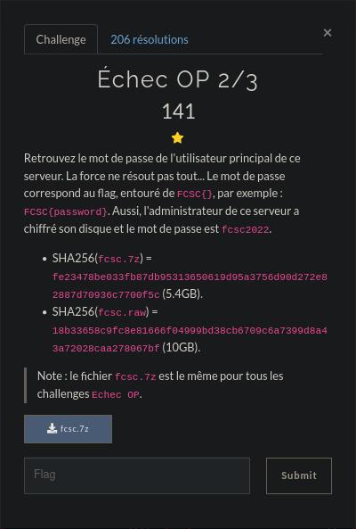

# Echec OP 2/3



Check last step to mount the encrypted partition<br>
speedrun:
```
$ sudo losetup -o 953155584 /dev/loop21 fcsc.raw
$ echo fcsc2022 | sudo cryptsetup luksOpen /dev/loop21 fcsc_decrypted
$ sudo mount /dev/mapper/ubuntu--vg-ubuntu--lv mountpoint/
```

# First look

I looked everywhere, check every directory, and tried to learn how the *passwd* and *shadow* files work<br>
*But to no avail*. I even checked a bashrc_history thinking I could get the command history, and dove in a rabbit hole about "naughty strings" and stuff. Stylé, but not really useful.<br>
After digging around, people brought up `chroot` a lot<br>
<br>
What is **chroot** ?<br>
*Changes root directory*. In short, you can type commands in the filesystem, as if you were ""inside"", logged in.<br>
While being in the mountpoint folder:
```
$ sudo chroot .
root:/# 
```
Scary. Lets try the `history` command I guess ?
```
root:/# history
	1  exit
	2  passwd obob 
	3  CZSITvQm2MBT+n1nxgghCJ
	4  exit
	5  history
```
Hehe, what just happened. We got the flag ! But how...<br>
`passwd` changes the current password of the user (here, 'obob'). This is our flag

## Flag
<details><summary>Flag</summary>
FCSC{CZSITvQm2MBT+n1nxgghCJ}
</details>

## But how ?
But how... I checked the */home/obob/.bash_history* and it's completely different from the `history` command output.<br>
How to **locate history file linux** ?<br>
A few links later, it seems like the file path is stoted in the **$HISTFILE** variable.
```
root:/# echo $HISTFILE
/root/.bash_history
root:/# cat /root/.bash_history 
exit
passwd obob 
CZSITvQm2MBT+n1nxgghCJ
exit
history
quit
```
Alright mystery solved, pack it up.

## Cleanup
```
root:/# exit
```
To exit chroot<br>
To cleanup the mounted partitions, check Echec OP (1 of 3) cleanup step

## Tools
```
chroot
history
echo $variable
```