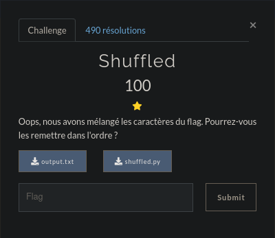

# Shuffled



## First look

After many, many, many searches online for the 'reverse' shuffle of the **shuffle** function given a seed, I found a beautiful explanation on [StackOverflow](https://crypto.stackexchange.com/questions/78309/how-to-get-the-original-list-back-given-a-shuffled-list-and-seed)<br>
Well though out mathematic demonstration. Yeah. I just copied his code.<br>
## Flag
Here is the flag after running the python script
<details><summary>Flag</summary>
FCSC{d93d32485aec7dc7622f13cd93b922363911c36d2ffd4f829f4e3264d0ac6952}
</details>

## But how ?

I pondered over this problem after solving it, trying to understand why it worked.<br>

<details>
	<summary>Full Python Code</summary>
	
	import random

	flag = list(open("output.txt", "rb").read().strip())

	def shuffle_under_seed(ls, seed):
		# Shuffle the list ls using the seed `seed`
		random.seed(seed)
		random.shuffle(ls)
		return ls

	def unshuffle_list(shuffled_ls, seed):
		n = len(shuffled_ls)
		# Perm is [1, 2, ..., n]
		perm = [i for i in range(1, n + 1)]
		# Apply sigma to perm
		shuffled_perm = shuffle_under_seed(perm, seed)
		# Zip and unshuffle
		ls = list(zip(shuffled_ls, shuffled_perm))
		ls.sort(key=lambda x: x[1])
		return ''.join(chr(a) for (a, b) in ls)

	for i in range(0, 256):
		print(unshuffle_list(flag, i))
</details><br>

**KEY INFORMATION:** The `shuffle` function of python, when given a `seed`, gives the same result if we re-use the same seed !<br>
The idea is to re-create the permutations of the seed + shuffle, 256 times (the output.txt is one of the permutations where seed is between 0 and 256)
<br><br>
We shuffle, look how it's shuffled and remember it. Now we do the invert operation on our shuffled output
<br>
<br>
Intuition:
- I shuffle 3 objects
- Position 2 is now 10, 5 is now 2, 10 is now 5
- I can write (2, 10), (5, 2), (10, 5)
- If i want to rearrange, I take the inverse of each "permutation"
- (2, 10) becomes (10, 2) because 10 is now 2... etc
- We need to map our shuffled flag to each pair, and MOVE those characters around in reverse like last step, because we know how it's been shuffled in the first place :)
<br>

One of those 256 permutations should give us the flag, which has "**FCSC**" in it ! At least I hope.

```
ole@ole-think:~/Téléchargements$ python3 shuffled.py 
7SfdC99434323359ca2{27d438c6fc2d92d203}dfc82f21f3b119d462Ca636c95de6Fe
...
+ 254 lines
...
f8cS394b7392ded2dC135235449C{383cd22fFd61daff6f231d6c632ea2c799024}9c6
$ python3 shuffled.py | grep FCSC
FCSC{d93d32485aec7dc7622f13cd93b922363911c36d2ffd4f829f4e3264d0ac6952}
$ 
```

## Improvements

Maybe trying to apply math and logic myself before copy-pasting other peoples code without properly understanding what it does<br>
But it worked right ? B)